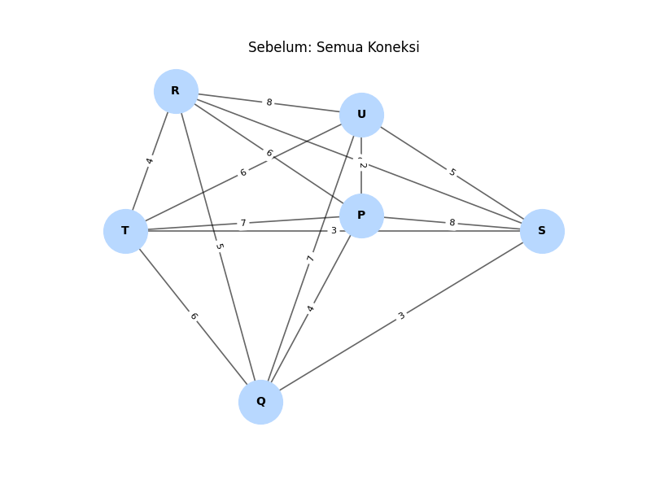
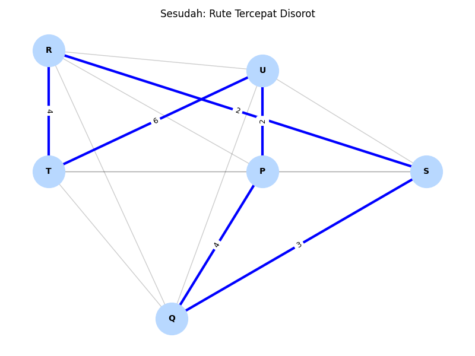
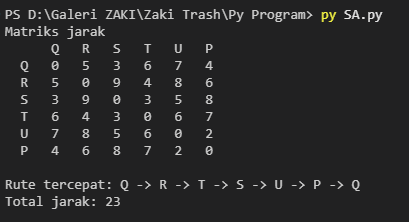

# Visualisasi Rute Tercepat TSP

## Hasil

### Matriks Jarak
| Dari/Ke | Q | R | S | T | U | P |
| --- | --- | --- | --- | --- | --- | --- |
| Q | 0 | 5 | 3 | 6 | 7 | 4 |
| R | 5 | 0 | 2 | 4 | 8 | 6 |
| S | 3 | 2 | 0 | 3 | 5 | 8 |
| T | 6 | 4 | 3 | 0 | 6 | 7 |
| U | 7 | 8 | 5 | 6 | 0 | 2 |
| P | 4 | 6 | 8 | 7 | 2 | 0 |

### Rute Terbaik
- Rute: `Q -> R -> T -> S -> U -> P -> Q`
- Total jarak: `23`

### Visualisasi

### Hasil Pencarian Algoritma

