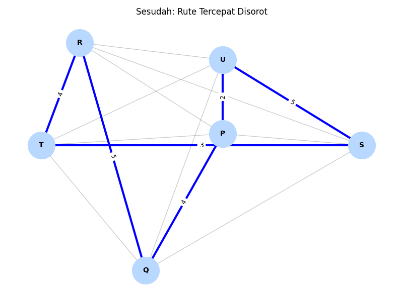

# Visualisasi Rute Tercepat TSP

## Ringkasan
Script `SA.py` membangun graf berbobot yang memodelkan jarak antar lokasi Q, R, S, T, U, dan P. Semua permutasi rute yang berawal dan berakhir di Q dihitung untuk menemukan lintasan terpendek (Traveling Salesman Problem) sekaligus divisualisasikan menggunakan NetworkX dan Matplotlib.

## Ketergantungan
- Python 3.10+
- networkx
- matplotlib

Instalasi cepat:
```
pip install networkx matplotlib
```

## Cara Menjalankan
```
python SA.py
```
Program akan mencetak matriks jarak, rute terbaik, dan secara default menampilkan dua jendela visualisasi.

## Hasil

### Matriks Jarak
| Dari/Ke | Q | R | S | T | U | P |
| --- | --- | --- | --- | --- | --- | --- |
| Q | 0 | 5 | 3 | 6 | 7 | 4 |
| R | 5 | 0 | 2 | 4 | 8 | 6 |
| S | 3 | 2 | 0 | 3 | 5 | 8 |
| T | 6 | 4 | 3 | 0 | 6 | 7 |
| U | 7 | 8 | 5 | 6 | 0 | 2 |
| P | 4 | 6 | 8 | 7 | 2 | 0 |

### Rute Terbaik
- Rute: `Q -> S -> R -> T -> U -> P -> Q`
- Total jarak: `21`

### Visualisasi




### Hasil Pencarian Algoritma


## Catatan
Apabila dijalankan di lingkungan tanpa tampilan grafis, Anda bisa mengganti `plt.show()` dengan `plt.savefig()` untuk menyimpan figur secara otomatis.
